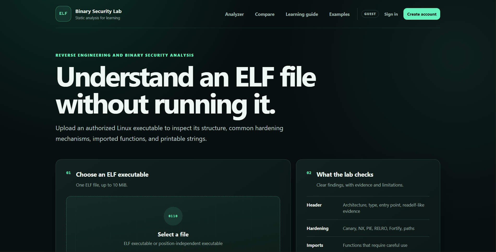
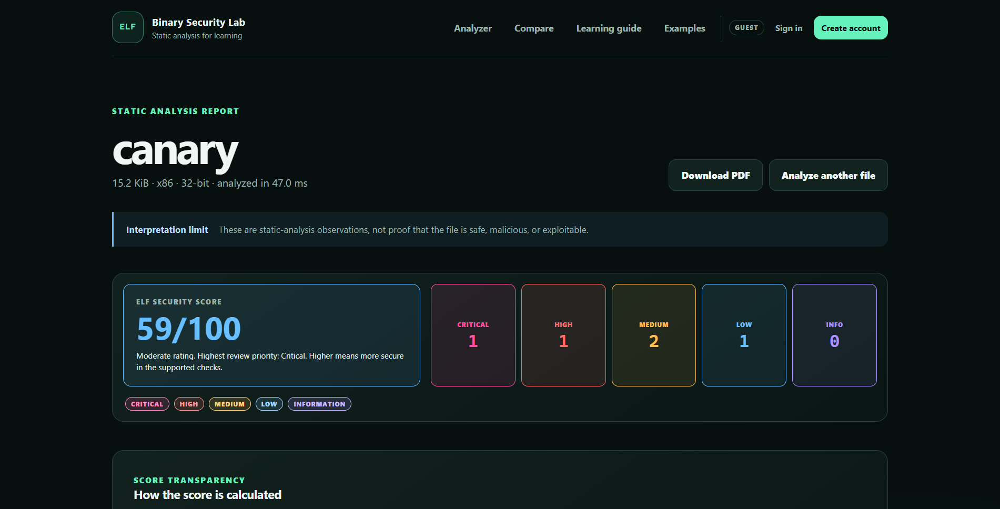

# Csec — ELF Security Learning System (v1)

A **Semester VI Cyber Security project** by Aung Myo Pyae, a University of Information Technology student. Csec is an educational web application for static inspection of Linux ELF binaries and for learning reverse engineering and executable hardening concepts.

**Release status: v1. Further upgrades are planned.**

## Screenshots

## Features

- ELF metadata: architecture, file type, endianness, entry point, and sections.
- Common hardening observations: Stack Canary, NX, PIE, RELRO, and Fortify.
- Imported functions, unsafe-function observations, extracted strings, URLs, and paths.
- Capstone-based disassembly with bounded output and explanatory report content.
- Side-by-side analysis of two ELF files and PDF report export.
- Learning guides and managed binary-example lessons.
- Student, instructor, and administrator roles, student report history, and learning progress.
- Local SQLite persistence for classroom content and account/report data.

## How analysis works

1. A user submits an ELF file through the analysis form, or two files through the comparison page.
2. Request handling checks the form token, rate limit, upload size, and file validation rules.
3. The file is stored temporarily and passed to the analysis controller.
4. Individual services parse ELF structures, inspect hardening evidence, extract strings/imports, and produce limited disassembly.
5. The results are combined with learning explanations and rendered as an HTML report. Signed-in student analyses can also be saved to report history.
6. PDF export uses the short-lived report cache. Temporary uploaded files are removed after analysis in the route cleanup path.

The analyzer reads file bytes; it does not intentionally execute uploaded programs. Observations are evidence for study, not proof that a file is safe or malicious. Windows PE/.exe files are not supported by this version.

## Architecture

| Path | Purpose |
| --- | --- |
| app.py | WSGI entry point and local development launcher |
| revlearn/__init__.py | Flask application factory and initialization |
| revlearn/routes.py | Analysis, comparison, reports, learning, and health routes |
| revlearn/services/ | ELF parsing, hardening, strings, functions, disassembly, and report services |
| revlearn/auth.py | Account/session workflows and create-user CLI |
| revlearn/classroom.py | Role-specific classroom features |
| revlearn/examples.py | Educational binary-example management |
| revlearn/database.py | SQLite schema and persistence helpers |
| revlearn/templates/ / revlearn/static/ | Server-rendered interface and assets |
| scripts/ | Environment launchers, database initialization, and upload cleanup |
| samples/vulnerable_demo.c | Deliberately unsafe educational sample source |
| tests/ | Existing project test suite |

## Requirements

Python **3.11+**. Dependencies are pinned in requirements.txt: Flask, pyelftools, Capstone, Waitress, and the existing test tooling. Linux is useful for building ELF samples; the web application can also inspect ELF files on Windows.

## Manual setup

Create a fresh virtual environment on each machine:

~~~sh
python -m venv .venv
~~~

Activate it using .venv/Scripts/activate on Windows or source .venv/bin/activate on Linux/macOS, then run:

~~~sh
python -m pip install -r requirements.txt
python scripts/init_db.py
python app.py
~~~

Open **http://127.0.0.1:5000/**. The local health endpoint is **/healthz**. Stop with Ctrl+C.

The project also includes scripts/run_windows.ps1 and scripts/run_kali.sh, which maintain machine-specific environments. See run.txt for their usage; replace its example drive paths with your own project location.

## Accounts and configuration

Public registration creates a student account. To create an approved instructor or administrator locally, activate the environment and run:

~~~sh
python -m flask --app app create-user --role instructor
python -m flask --app app create-user --role admin
~~~

The commands prompt for account details and a password. No default account or password is shipped.

| Environment variable | Purpose / default |
| --- | --- |
| REVLEARN_SECRET_KEY | Stable private session key; a random development key is used if absent |
| REVLEARN_HOST / REVLEARN_PORT | Local bind address / port; 127.0.0.1 / 5000 |
| REVLEARN_DEBUG | Debug mode; off unless set to 1 |
| REVLEARN_MAX_UPLOAD_MB | Upload limit; 10 MB by default |
| REVLEARN_ANALYSIS_TIMEOUT | Analysis timeout; 5 seconds by default |
| REVLEARN_MAX_STRINGS / REVLEARN_MAX_INSTRUCTIONS | Limits on extracted output |
| REVLEARN_HTTPS | Enable secure session cookies when using HTTPS |

Generated learning.db and uploads are kept under the local instance directory. Keep the session key and classroom/user data out of Git.

## Suggested walkthrough

Use ELF files you own or are authorized to inspect. Analyze a file, read the hardening evidence and learning explanations, then compare two builds with different compiler hardening settings. Register a student to explore saved reports and learning progress. Instructor accounts can manage educational lessons.

The included vulnerable_demo.c is deliberately unsafe teaching material. Building or executing it is not required to run the analyzer. Detailed optional lab commands are in run.txt.

## Scope and version notes

The controls and in-memory limits target local classroom use. Keep the application on loopback for a personal demo; a shared deployment requires a suitable production server and deployment review. Virtual environments, generated reports, local databases, and uploads are excluded. Existing tests are retained, but they were not run as part of this documentation-only publication update.
